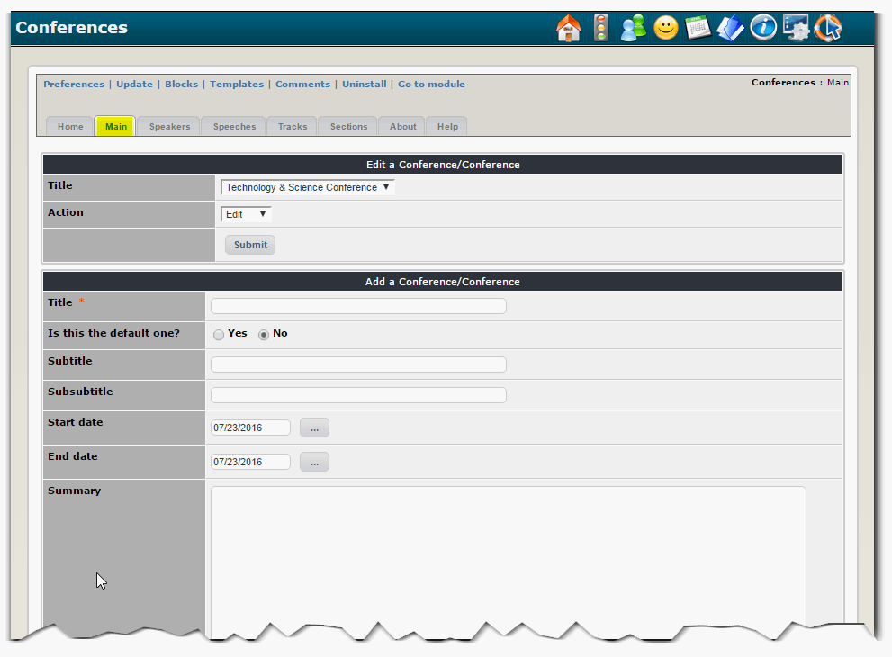
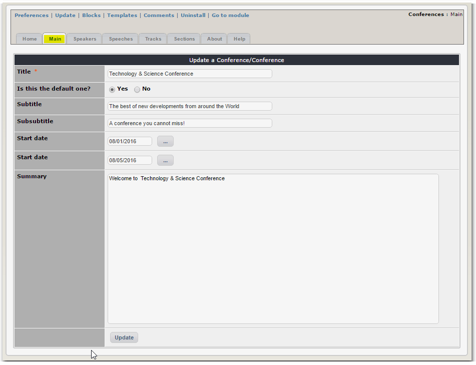
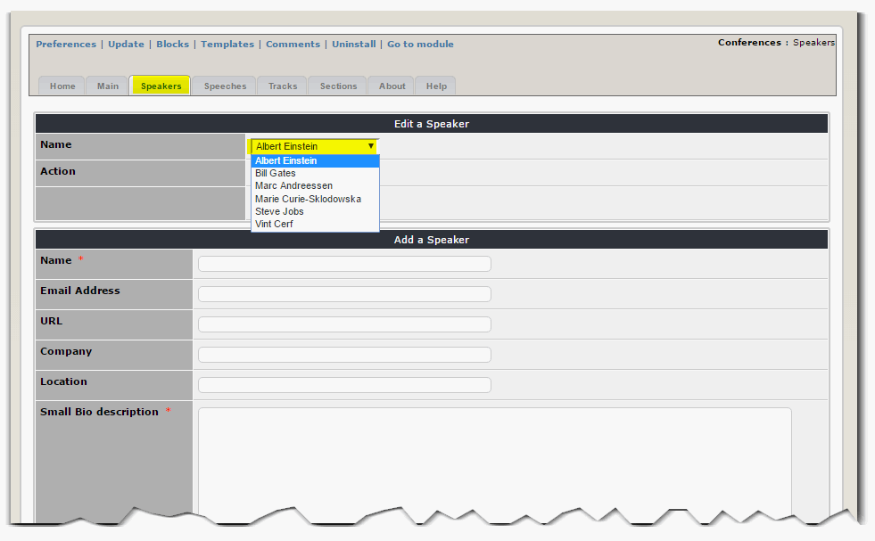
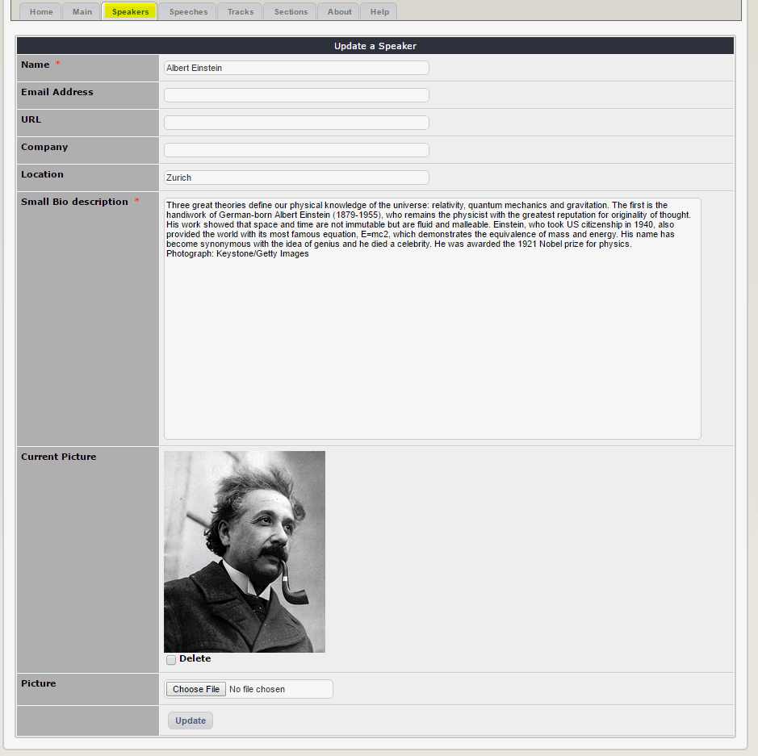
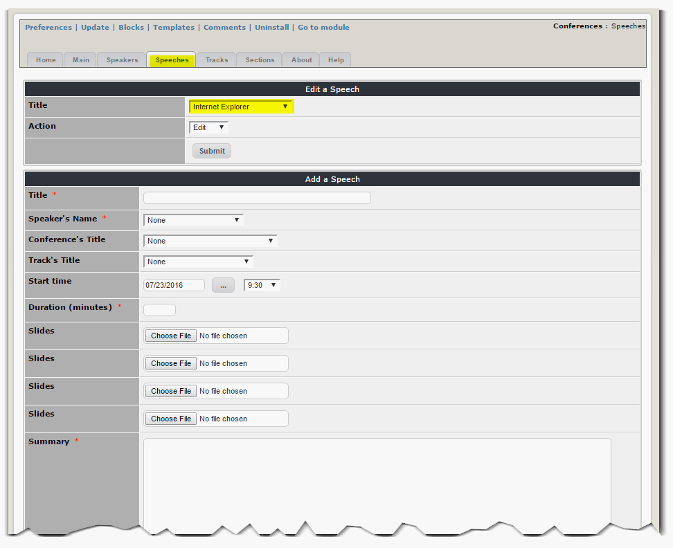
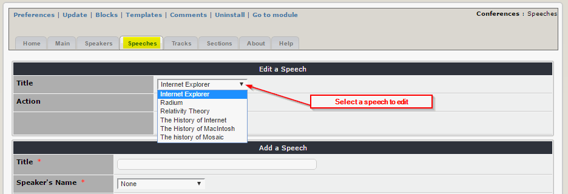
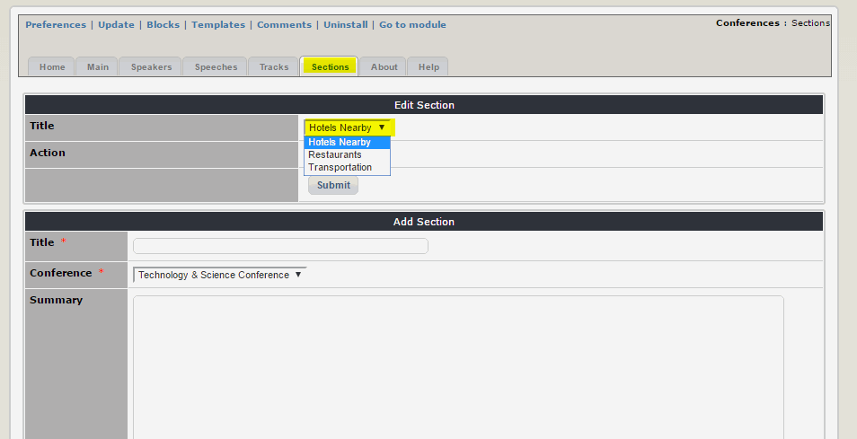
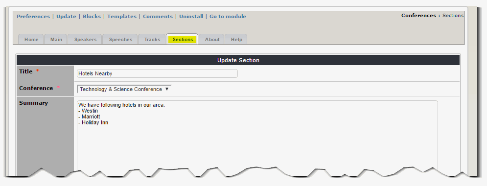
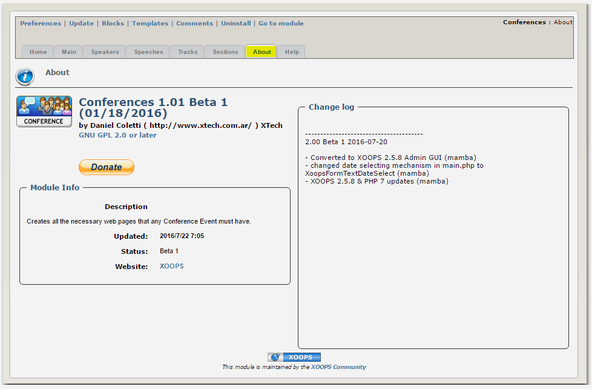
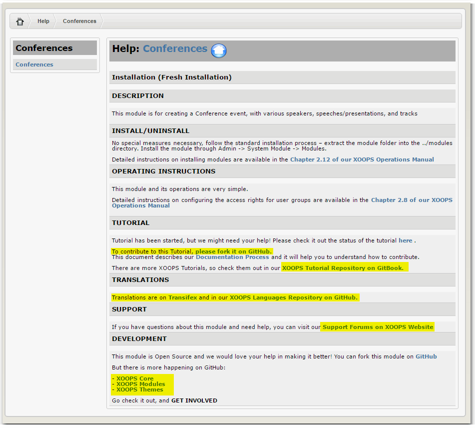

# 2.0 Administration Menu

The central Admin view

The Main Tab is for setting up the Conferences or Congresses. 

You can define dates, provide some basic information about the Conference

You can add here your speakers

and enter details about them.  The Speaker information is independent of the congress itself, so you can reuse this person's information in another event. 

In the Speeches Tab you can provide information about the individual Speeches or Presentations.  

To edit an existing speech, you just need to select one

The Speeches have a strong relation with the congress, track and speaker, so it is the last thing you will fill out. 

A Track is something used at congresses to organize the speeches, the idea is that a particular person won't have to face (at least not too many times) the "I want to be at two different presentations at the same time". 

There're also the Sections, these are specificaly for congress information data. Things like "Hotels close to the event", "Location", "Who's giving this event", "Sponsors", anything directly related with the event. These sections will show as a header for almost every page. 

For example, you can provide information and links to the hotels 

The "About" Tab provide info about the module, its version, authors, and the changelog.

Here you have basic help, with some useful links